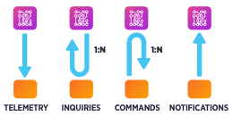

#IoT
### Diego Sepúlveda
---
##¿Qué es exactamente el IoT?

_"... la interconexión de cualquier producto con cualquier otro a su alrededor ..."_

Note:
- Con el pasar del tiempo, la capacidad de poder capturar información desde distintos dispositivos se ha incrementado drásticamente.
- Múltiples fuentes de información emitiendo contenidos para su análisis.

---
##IoT, el Origen
Bill Joy imaginó la comunicación D2D (del inglés: Device to Device, dispositivo a dispositivo), como parte de su estructura de las "Seis Webs" (en 1999 en el Foro Económico Mundial de Davos ); pero no fue hasta la llegada de Kevin Ashton que la industria tomó un segundo vistazo a la utilidad del internet de las cosas.

Note:
Bill, cofounder of Sun: Considerado uno de los mejores programadores de la historia, (escribío el nucleo de BSD en un fin de semana), con fundador de Sun Microsystem,. describió que la comunicacion máquina a máquina sería parte de una de las 6 webs. Las 6 web’s son:
- La internet que puedes ver en una pantalla,
- La internet que siempre llevas contigo
- La internet que puedes apreciar en la pantalla grande
- La internet extraña, aquella que es capaz percibir instrucciones mediante la voz y puedes oír.
- B2B: la internet que permite a las máquinas de negocios interactuar entre ellas,
- D2D: la internet que permite a las dispositivos comunicarse entre sí.

Kevin, RFDI inventor y cofundador del Auto-ID Lab (centro de investigación en el MIT): Inventor del concepto “Internet de las cosas”, que describe un sistema donde el internet esta conectado al mundo físico mediante sensores ubicuos.
Desarrolladores de la arquitectura del IoT auspiciados por empresas como  HP, Walmart.

---
##Incidencias
- Impacto Social <!-- .element: class="fragment" -->
- Cambio económico <!-- .element: class="fragment" -->
- Evolución <!-- .element: class="fragment" -->

Note:
- Las personas ven como sus vidas se facilitan, y medios digitales les entregan con mayor detalle información que necesitan o no.
- Posibilidad de nuevos negocios
- Reducción de costos
- Dependencia de los aparatos

---
##Aspectos del software/hardware involucrados

- Machine learning
- Real Time Analytics
- Sensores
- Embedded Systems

---
##Aplicaciones Actuales
- Media <!-- .element: class="fragment" -->
- Monitoreo del entorno <!-- .element: class="fragment" -->
- Administración de infraestructuras <!-- .element: class="fragment" -->
- Manufacturación de productos <!-- .element: class="fragment" -->
- Agricultura <!-- .element: class="fragment" -->
- Administración de la energía <!-- .element: class="fragment" -->
- Medicina <!-- .element: class="fragment" -->
- Domótica <!-- .element: class="fragment" -->
- Transporte <!-- .element: class="fragment" -->
- ... <!-- .element: class="fragment" -->
---
##Addressing & Auto-ID Center
- Auto-ID Center: centro de investigación y desarrollo en el MIT quienes desarrollaron el protocolo RFID (radio frequency identification)
- Cada objeto capaz de conectarse a la red debe poseer un identificador único, que lo distinga de otro, a pesar que posean características similares.
- Inconvenientes con el direccionamiento de los dispositivos, el protocolo IPv4 es limitado.
---
##Internet 0
Hace referencia a una capa física encargada solamente de la asignación de direcciones IP a cualquier cosa, de baja velocidad y económica.
En el internet 0, los mensajes RFID se transforman en datos físicos, capaces de ser capturados/enviados directamente por dispositivos ubicuos y procesar la información que contienen para la toma de decisiones.
---
##Computación Ubicua
Se refiere a cómo la computación (el software) se integra con el entorno de las personas.
- Ej: Personas consultando indicaciones a un panel de información en el Mall.
---
##Características del IoT
- Inteligencia:
  - Los participantes podr+an actuar de forma independiente (perseguir objetivos propios) y tomar decisiones de acuerdo al ambiente.
- Arquitectura:
  - Arquitectura dirigida a eventos
Caótico y complejo
  - Una gran cantidad de actores participando del proceso de compartir sus datos y que requieren atención.
---
##Características del IoT
- Tiempo:
  - El tiempo ya no puede ser considerado ni tratado como una unidad lineal, muchos eventos paralelos y simultáneos.
- Seguridad:
  - Toda la información circulante debe estar protegida.
---
#Internet of Things
##Protocolos de Mensajería
---
##Better QoS
- Better Quality of Service:
  - Verificar cada envió de los datos
  - Basado en mensaje - respuesta (algunas veces comprobación)
---
##Message Persistence
- Message Persistence
  - Almacenamiento permanente de los mensajes
---
##Patrones de mensajería

---
##Telemetry
Implementación del patrón de dos modos:
- Como cliente: Envía peticiones PUT/POST para actualizar el estado del dispositivo.
- Como servidor: Recibe peticiones GET consultando por información.
En cualquier caso todo se trata de peticiones y respuestas. Se basa en el concepto de “Publicador/Suscriptor”, además se basa en el QoS.
---
##Inquiry
El dispositivo envía peticiones GET al servidor para obtener información.
---
##Command
Basado en la arquitectura de cliente/servidor, el servidor envía instrucciones al dispositivo esperando resultados.
---
##Notification
Similar a Command y Telemetry, el servidor envía notificaciones, o instrucciones, pero este no queda a la espera de respuestas.
---
##El IoT
El internet de las cosas no es más que mensajería, la cual está previamente definida por los patrones. Bajo la arquitectura de cliente/servidor, publicador/suscriptor, petición/respuesta o cualquier otra, los protocolos proveen diferentes maneras de trabajo, nativas o no.
---
##Consideraciones claves
Sensores
- Sistema operativo para IoT
- Abstracción del hardware
- Soporte de comunicación
- Administración remota
---
##Consideraciones claves
Conecciones y “Smartthings”
- Sistema operativo para el sistema base
- Containers y/o ambientes en tiempo real
- Comunicación y conectividad
- Administración de datos y mensajería
- Administración remota
---
##Consideraciones claves
IoT en la nube
- Conectividad y enrutamiento de los mensajes
- Administración y registro de los dispositivos
- Administración y almacenamiento de los datos
- Administración de eventos, Analítica y UI
- Disponibilización de las aplicaciones
---
##Consideraciones claves
Transversales
- Seguridad
- Descripción de los mensajes, datos y “Data interoperability ”
- Herramientas de desarrollo
---
##Consideraciones claves
Características relevantes que debe cumplir un stack de IoT
- Bajo acoplamiento
- Modular
- Independiente de plataforma
- Basado en estándares abiertos
- Apis de comunicación bien definidas

---
#IoT
##Microservicios
---
